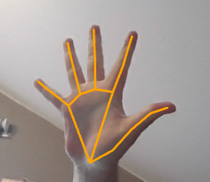
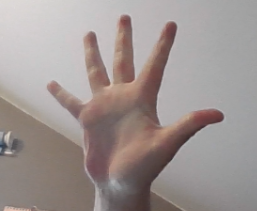

# Gesture Recognition Sample

This is a python sample algorithm, that subscribes to webcam images, detects hands in that images and publishes their gesture and detected points. They can then be visualized using Foxglove Studio.

pb2-files are created with lib grpcio. In CMD: `python -m grpc_tools.protoc -I. --python_out=. RecognizedGesture.proto`
